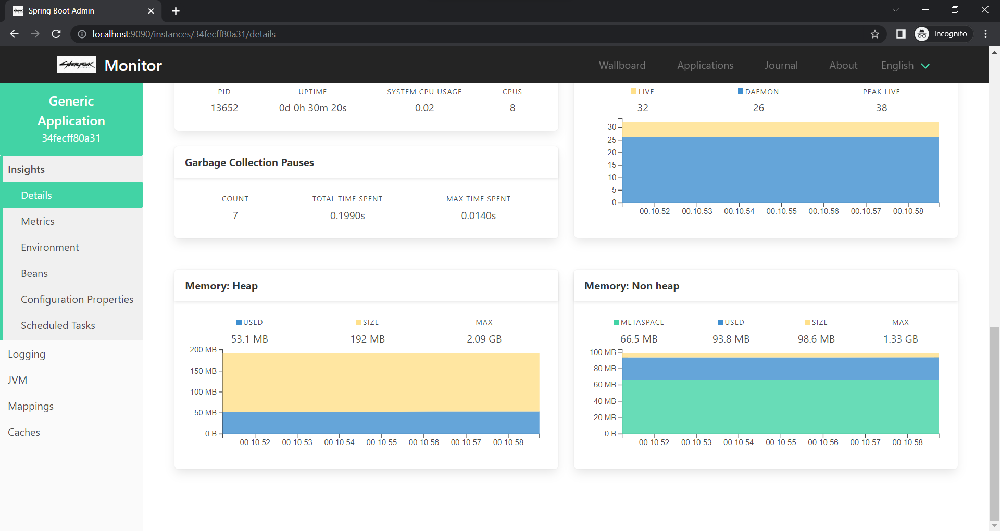

### Monitoring spring boot application with Spring boot admin client-server dependency.

* Here, we have two spring boot application where the **Generic spring boot module** is an admin client application and **Spring monitor module** is an admin server which monitor the admin client one.
 
## Modules

### Generic spring boot module

* Configuration 
    * Actuator endpoints configuration.
    * Spring boot admin client configuration
    * Primary datasource.
    * Logging configuration.
* Scheduler
    * Schedular to insert data in primary datasource.
* Resource
    * All DDL required in resources folder.

### Spring monitor module
* Configuration
    * Spring boot admin server configuration.

## Steps

1. Spin up the Generic spring boot module.
2. Spin up the Spring monitor module.
3. Open [http://localhost:9090/applications](http://localhost:9090/applications).

## Reference

* [https://codecentric.github.io/spring-boot-admin/current/](https://codecentric.github.io/spring-boot-admin/current/)
* [https://levelup.gitconnected.com/application-monitoring-using-spring-boot-admin-part-2-ed14178c6964](https://levelup.gitconnected.com/application-monitoring-using-spring-boot-admin-part-2-ed14178c6964)
* [https://levelup.gitconnected.com/application-monitoring-using-spring-boot-actuators-part-1-dab8576f4db6](https://levelup.gitconnected.com/application-monitoring-using-spring-boot-actuators-part-1-dab8576f4db6)

## Images

